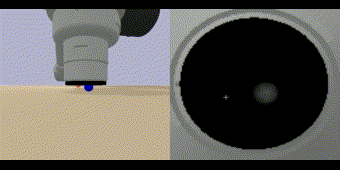
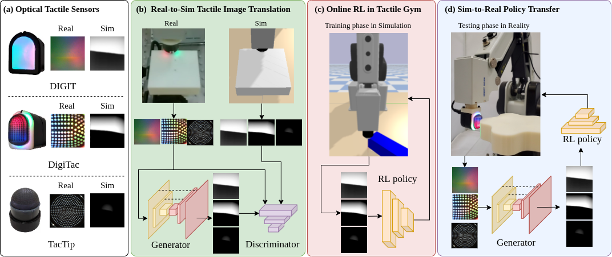

# Tactile-Gym 2.0: RL suite for tactile robotics (with multiple tactile sensors)
[](LICENSE)
[](https://github.com/psf/black)
[](https://hits.seeyoufarm.com)

<!-- [Project Website](https://sites.google.com/my.bristol.ac.uk/tactile-gym-sim2real/home) &nbsp;&nbsp;• -->
**Tactile Gym 2.0**: [Project Website](https://sites.google.com/my.bristol.ac.uk/tactilegym2/home) &nbsp;&nbsp;•&nbsp;&nbsp;[Paper](https://ieeexplore.ieee.org/abstract/document/9847020)

**Tactile Gym 1.0**: [Project Website](https://sites.google.com/my.bristol.ac.uk/tactile-gym-sim2real/home) &nbsp;&nbsp;•&nbsp;&nbsp;[Paper](http://arxiv.org/abs/2106.08796)

This repo is built on top of the [Tactile Gym](https://github.com/ac-93/tactile_gym) and now is open-sourced as [Tactile Gym 2.0](https://github.com/yijionglin/tactile_gym_2), which has been extended to include three tactile sensors (DigiTac, DIGIT, TacTip) of two widely-used yet fundamentally different types: [Tactip style](https://www.liebertpub.com/doi/full/10.1089/soro.2017.0052) and [Gelsight style](https://www.mdpi.com/1424-8220/17/12/2762). To make it easier for the research community of tactile robotics, we have also integrated a low-cost off-the-sheld industrial-level-accuracy desktop robot DOBOT MG400 for three learning environments as shown below, and successfully transferred the learned policies into the real world without any further fine-tuning (checkout our [project website](https://sites.google.com/my.bristol.ac.uk/tactilegym2/home) for more sim-to-real demonstrations).

<!-- This repo provides a suite of [PyBullet](https://github.com/bulletphysics/bullet3) reinforcement learning environments targeted towards using tactile data as the main form of observation. -->

<!-- <p align="center">
  
   <br>
  
  
  
</p> -->

<p align="center">
   &nbsp;&nbsp;&nbsp;&nbsp;   
   &nbsp;&nbsp;&nbsp;&nbsp;   
   <br>
   &nbsp;&nbsp;&nbsp;&nbsp;
    &nbsp;&nbsp;&nbsp;&nbsp;
   &nbsp;&nbsp;&nbsp;&nbsp;
</p>


This repo refers to the paper "*Sim-to-real Deep Reinforcement Learning for Comparing Low-cost High-Resolution Robot Touch*". If you find it useful for your research, please cite our paper.

<p align="center">
  <br>
  The main framework
</p>

### Content ###
- [Installation](#installation)
- [Testing Environments](#testing-environments)
- [Tactile Robot Environment Details](#tactile-robot-environment-details)
- [Observation Details](#observation-details)
- [Training Agents](#training-agents)
- [Re-training Agents](#re-training-agents)
- [Pretrained Agents](#pretrained-agents)
- [Alternate Robot Arms](#preliminary-support-for-alternate-robot-arms)
- [Additional Info](#additional-info)
<!-- - [Environment Details](#environment-details) -->


### Installation ###
This repo has only been developed and tested with Ubuntu 18.04 and python 3.8.

```
# TODO: install via pypi
git clone https://github.com/yijionglin/tactile_gym_2
cd tactile_gym
python setup.py install
```

### Testing Environments ###

Demonstration files are provided for all environments in the example directory. For example, from the base directory run
```
python examples/demo_example_env.py
```
to run a user controllable example environment.


### Tactile Robot Environment Details ###


#### 1. Availability ####

Usage: You can specify a desired robot arm and a tactile sensor, e.g. by setting `arm_type = "MG400", tactile_sensor_name = "DigiTac"`  in the env_params.py.

| **Env. Name (w/ MG400)**        | `TacTip`            |     `DigiTac`       |       `DIGIT`       |  
| ------------------- |  ------------------ |  ------------------ | ------------------- | 
| `edge_follow-v0`     |  :heavy_check_mark: |  :heavy_check_mark: |  :heavy_check_mark: |
| `surface_follow-v2`   |  :heavy_check_mark: |  :heavy_check_mark: |  :heavy_check_mark: |
| `object_push-v0`      |  :heavy_check_mark: |  :heavy_check_mark: |  :heavy_check_mark: |


| **Env. Name &nbsp;&nbsp;&nbsp;(w/ UR5)** &nbsp;&nbsp; | `TacTip`            |     `DigiTac`       |       `DIGIT`       |  
| ------------------- |  ------------------ |  ------------------ | ------------------- | 
| `edge_follow-v0`      |  :heavy_check_mark: |  :heavy_check_mark: |  :heavy_check_mark: |
| `surface_follow-v0`   |  :heavy_check_mark: |   :heavy_check_mark:  |   :heavy_check_mark:  |
| `surface_follow-v1`   |  :heavy_check_mark: |   :heavy_check_mark:  |   :heavy_check_mark:  |
| `surface_follow-v2`   |  :heavy_check_mark: |  :heavy_check_mark: |  :heavy_check_mark: |
| `object_roll-v0`      |  :heavy_check_mark: |  :heavy_multiplication_x: |  :heavy_multiplication_x: |
| `object_push-v0`      |  :heavy_check_mark: |  :heavy_check_mark: |  :heavy_check_mark: |
| `object_balance-v0`   |  :heavy_check_mark: |   :heavy_check_mark:  |   :heavy_check_mark:  |

<!-- :heavy_multiplication_x:  -->
#### 2. Environment Details ####

| **Env. Name** | Description |
| :---: | :--- |
| `edge_follow-v0` | <ul><li>A flat edge is randomly orientated through 360 degrees and placed within the environment. </li><li>The sensor is initialised to contact a random level of pentration at the start of the edge.</li><li>The objective is to traverse the edge to a goal at the oposing end whilst maintaining that the edge is located centrally on the sensor.</li></ul>  |
| `surface_follow-v0`   | <ul><li>A terrain like surface is generated through [OpenSimplex Noise](https://pypi.org/project/opensimplex/).</li><li>The sensor is initialised in the center, touching the surface.</li><li>A goal is randomly placed towards the edges of the surface.</li><li>The objective is to maintain a normal orientation to the surface and a set penetration distance whilst the sensor is automatically moved towards the goal.</li></ul> |
| `surface_follow-v1`   | <ul><li>Same as `-v0` however the goal location is included in the observation and the agent must additionally learn to traverse towards the goal.</li></ul> |
| `surface_follow-v2`   | <ul><li>Same as `-v0` but verticalized, and this is used for training 4-DoF robots (MG400, Magician) which only have x-, y-, z-, and Rz-axes actuated.</li></ul> |
| `object_roll-v0`   | <ul><li>A small spherical object of random size is placed on the table.</li><li>A flat tactile sensor is initialised to touch the object at a random location relative to the sensor.</li><li>A goal location is generated in the sensor frame.</li><li>The objective is to manipulate the object to the goal location.</li></ul> |
| `object_push-v0`   | <ul><li>A cube object is placed on the table and the sensor is initialised to touch the object (in a right-angle configuration).</li><li>A trajectory of points is generated through OpenSimplex Noise.</li><li>The objective is to push the object along the trajectory, when the current target point has been reached it is incremented along the trajectory until no points are left.</li></ul> |
| `object_balance-v0`   | <ul><li>Similar to a 2d CartPole environment.</li><li>An unstable pole object is balanced on the tip of a sensor pointing upwards.</li><li>A random force pertubation is applied to the object to cause instability.</li><li>The objective is to learn planar actions to counteract the rotation of the object and mantain its balanced position.</li></ul> |


#### 3. Tactile Sensors: ####

| **Sensor Name** | Description |
| :---: | :--- |
| `TacTip` | [Tactip](https://www.liebertpub.com/doi/full/10.1089/soro.2017.0052) is a soft, curved, 3D-printed tactile skin with an internal array of pins tipped with markers, which are used to amplify the surface deformation from physical contact against a stimulus.  |
| `DIGIT`   |  [DIGIT](https://digit.ml/) shares the same principle of the [Gelsight tactile sensor](https://www.mdpi.com/1424-8220/17/12/2762), but can be fabricated at low cost and is of a size suitable for integration of some robotic hands, such as on the fingertips of the Allegro. |
| `DigiTac`   | DigiTac is an adapted version of the DIGIT and the TacTip, whereby the 3D-printed skin of a TacTip is customized to integrated onto the DIGIT housing, while keeping the camera and lighting system. In other words, this sensor outputs tactile images of the same dimension as the DIGIT, but with a soft biomimetic skin like other TacTip sensors. |


### Observation Details ###

All environments contain 4 main modes of observation:

| Observation Type | Description |
| :---: | :--- |
| `oracle` | Comprises ideal state information from the simulator, which is difficult information to collect in the real world, we use this to give baseline performance for a task. The information in this state varies between environments but commonly includes TCP pose, TCP velocity, goal locations and the current state of the environment. This observation requires signifcantly less compute both to generate data and for training agent networks.|
| `tactile` | Comprises images (default 128x128) retrieved from the simulated optical tactile sensor attached to the end effector of the robot arm (Env Figures right). Where tactile information alone is not sufficient to solve a task, this observation can be extended with oracle information retrieved from the simulator. This should only include information that could be be easily and accurately captured in the real world, such as the TCP pose that is available on industrial robotic arms and the goal pose. |
| `visual` | Comprises RGB images (default 128x128) retrieved from a static, simulated camera viewing the environment (Env Figures left). Currently, only a single camera is used, although this could be extended to multiple cameras. |
| `visuotactile` |  Combines the RGB visual and tactile image observations to into a 4-channel RGBT image. This case demonstrates a simple method of multi-modal sensing. |

When additional information is required to solve a task, such as goal locations, appending `_and_feature` to the observation name will return the complete observation.

### Training Agents ###

The environments use the [OpenAI Gym](https://gym.openai.com/) interface so should be compatible with most reinforcement learning librarys.

We use [stable-baselines3](https://github.com/DLR-RM/stable-baselines3) for all training, helper scripts are provided in `tactile_gym/sb3_helpers/`

A simple experiment can be run with `simple_sb3_example.py`, a full training script can be run with `train_agent.py`. Experiment hyper-params are in the `parameters` directory.

**Training with image augmentations:** If intending to use image augmentations for training, as done in the paper, then [this](https://github.com/ac-93/stable-baselines3-contrib) fork of sb3 contrib is required. (**TODO: Contribute this to sb3_contrib**).

### Re-training Agents ###

Now you can retrain your model by:
```bash
python train_agent.py --if_retrain=True --retrain_path=~/saved_models/env_name/algo_name/
```

This can help you fast train a policy that already learned with one robot for another robot with the same tactile sensor instead of from scratch.
### Pretrained Agents ###
RL models for DIGIT and DigiTac: these can be downloaded [here](https://drive.google.com/drive/folders/1VVrnMVaQeX05C9Uo4126ATDNIPFpf2Ga?usp=sharing)
and placed in `tactile_gym/sb3_helpers/saved_models`.

```
python tactile_gym/sb3_helpers/eval_agent_utils.py
```

Example PPO/RAD_PPO agents, trained via SB3 are provided for all environments and all observation spaces. These can be downloaded [here](https://drive.google.com/drive/folders/1stIhPc0HBN8fcJfMq6e-wHcsp6VpJafQ?usp=sharing)
and placed in `tactile_gym/examples/enjoy`.

In order to demonstrate a pretrained agent from the base directory run
```
python examples/demo_trained_agent.py -env='env_name' -obs='obs_type' -algo='algo_name'
```

### Preliminary Support for Alternate Robot Arms ###

The majority of testing is done on the simulated UR5 robot arm. The Franka Emika Panda and Kuka LBR iiwa robot arms are additionally provided however there may be bugs when using these arms. Particularly, workframes may need to be adjusted to ensure that arms can comfortably reach all the neccessary configurations. These arms can be used by changing the `self.arm_type` flag within the code.

<p align="center">
  
</p>


### Bibtex ###
```
@InProceedings{lin2022tactilegym2,
     title={Tactile Gym 2.0: Sim-to-real Deep Reinforcement Learning for Comparing Low-cost High-Resolution Robot Touch},
     author={Yijiong Lin and John Lloyd and Alex Church and Nathan F. Lepora},
     journal={IEEE Robotics and Automation Letters},
     year={2022},
     volume={7},
     number={4},
     pages={10754-10761},
     editor={R. Liu A.Banerjee},
     series={Proceedings of Machine Learning Research},
     month={August},
     publisher={IEEE},
     doi={10.1109/LRA.2022.3195195}}
     url={https://ieeexplore.ieee.org/abstract/document/9847020},
}

@InProceedings{church2021optical,
     title={Tactile Sim-to-Real Policy Transfer via Real-to-Sim Image Translation},
     author={Church, Alex and Lloyd, John and Hadsell, Raia and Lepora, Nathan F.},
     booktitle={Proceedings of the 5th Conference on Robot Learning}, 
     year={2022},
     editor={Faust, Aleksandra and Hsu, David and Neumann, Gerhard},
     volume={164},
     series={Proceedings of Machine Learning Research},
     month={08--11 Nov},
     publisher={PMLR},
     pdf={https://proceedings.mlr.press/v164/church22a/church22a.pdf},
     url={https://proceedings.mlr.press/v164/church22a.html},
}
```
